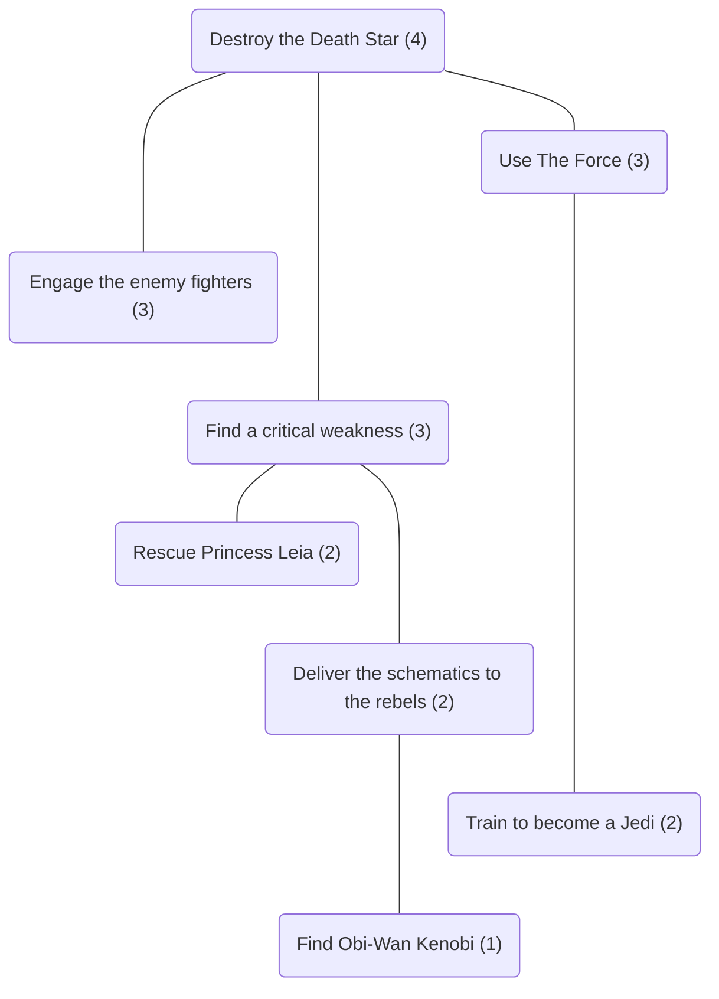

# Prophecy
A tabletop roleplaying game about a group of heroes who dare to defy fate.

---

## Overview

During the game the Players tell the _Story_.

To tell the Story, the Players will:
  1. [Receive the Prophecy](#receive-the-prophecy)
  2. [Create Characters](#create-characters)
  3. [Shape Destiny](#shape-destiny)
  4. [Tell the Tale](#tell-the-tale)

---

## Scenes
A _Scene_ is a part of the Story that describes the events that happen at single time and place.
Every Scene has the following components:
  - __Objective__ - A narrative description of what the Characters are trying to accomplish during the Scene.
  - __Setting__ - The time and place at which the Scene occurs. The Setting includes the [Objects](#objects-and-aspects) that appear in the Scene and the [Aspects](#objects-and-aspects) that are attached to those Objects.
  - __Difficulty Rating__ - A number that describes how difficult it is for the characters to succeed at the [Check](#checks) to determine the Scene's Outcome. Scenes will have a difficulty rating _d_ with _1 <= d <= 4_.

#### Example
The Characters want to cross the border between two neighbouring kingdoms. It is dusk when they make their way to a "Remote" border crossing on the outskirts of a small town. The border is patrolled by a detachment of soldiers from the "Local Militia". The soldier on duty when the Characters arrive is well-known in town to have a "Sterling Reputation". The guards are on "High Alert" and it will be fairly difficult for the Characters to convince the guard on duty to let them through the checkpoint. The Difficulty Rating of the scene is _d = 3_.

### Sketching Scenes
Players _Sketch_ the Scenes that comprise the Story when they [Shape Destiny](#shape-destiny). To Sketch a Scene, the Players will define the Objective, establish the Setting, and assign the Difficulty Rating for the Scene.

### Performing Scenes
Players _Perform_ the Scenes that comprise the Story when they [Tell the Tale](#tell-the-tale). To Perform a Scene, the Players will identify pairs of Matching Aspects, make a Check, and interpret the Outcome.

---

## Objects and Aspects
An _Object_ is a person, place, or thing that appears in the Story.
An _Aspect_ is a word or short phrase that describes something noteworthy about an _Object_.
Each aspect is _Attached_ to a single Object.

There are two kinds of aspects:
   - __Character Aspects__ - These are Aspects that are Attached to a [Character](#characters).
   - __Environment Aspects__ - These are Aspects that are Attached to anything that is not a Character.

A pair of _Matching Aspects_ is a set of two Aspects, one Character Aspect and one Environment Aspect, that together allow the Characters to manipulate a [Scene](#scenes) to their advantage.
Pairs of Matching Aspects are used to determine the size of the Dice Pool when making a [Check](#checks).

#### Example
Recall that in the previous example, the Characters were trying to convince a guard to let them through a checkpoint and that the Aspect "Sterling Reputation" is Attached to the guard who is on duty when the Characters arrive.
The Aspect "Silver Tongue" is Attached to one of the Characters.
If the Players agree that this combination of Aspects might allow the characters to manipulate the Scene to their advantage, perhaps by suggesting that he guard might be amenable to accepting a bribe offered by the Character, then together they would constitute a pair of Matching Aspects.

---

## Checks
The players make a _Check_ to determine the _Outcome_ of each [Scene](#scenes).
To make a Check, the Players will:
   1. __Assemble a Dice Pool__ -
      A Dice Pool is made up of one or more six-sided dice (d6s).
      One die is added to the Dice Pool for each pair of [Matching Aspects](#objects-and-aspects) that characters could use to manipulate the scene to their advantage.
      In addition, one _Reward Die_ is added to the Dice Pool for each scene immediately upstream of the current scene that was resolved successfully.
   2. __Roll the Dice__ -
      The dice in the Dice Pool are _Exploding Dice_.
      That is, for every die that yields a value of `6` one additional die is added to the Dice Pool and rolled.
   3. __Compute the Result__ -
      Any die that yields a value of `1`, `2`, or `3` is a _Miss_.
      Any die that yields a value of `4`, `5`, or `6` is a _Hit_.
      The _Result_ of a roll is the total number of Hits.
   4. __Determine the Outcome__ -
      If the result of the Players' roll meets or exceeds the Scene's Difficulty Rating, then the Outcome is a _Succeess_ at the characters accomplish their objective.
      Otherwise, the Outcome is a _Failure_ and the Characters do not accomplish their objective.

#### Example
The Players are making a Check to determine the Outcome of a Scene that has a Difficulty Rating of _d = 3_.
The Players have identified three pairs of [Matching Aspects](#objects-and-aspects) while Performing the Scene and earned two Reward Dice in the Scenes immediately upstream of the current Scene.
Therefore, the Dice Pool consists of five dice.
When rolled, these dice yield the values {`3`, `6`, `5`, `1`, `6`}.
Because two of the dice yielded a value of `6`, two additional dice are added to the pool.
When rolled, these dice yield the values {`2`,`6`}.
Because one of the dice yielded a value of `6`, one additional die is added to the pool.
When rolled, this die yields the value {`4`}.
So, this roll yields the values {`3`, `6`, `5`, `1`, `6`, `2`, `6`, `4`}.
The Result of this roll is five Hits.
This Result exceeds the Difficulty Rating of the Scene so the Outcome of the Check is a Success.   

---

## Characters
During the game, each Player will assume the identity of a Character.
Each Character has a _Name_ and a set of [Character Aspects](#objects-and-aspects) that are Attached to them.

To create a new Character, a Player will first choose a Name then Attach one Aspect from each of the following categories to that character:
   - __Occupation__ - An Aspect that describes a Character's profession, hobbies, or other interests.
   - __Physical or Mental Characteristic__ - An Aspect that describes a Character's body or mind.
   - __Psychological Characteristic__ - An Aspect that describes a Character's personality.
   - __Relationship__ - An Aspect that describes a Character's connection with another Character.
   - __Affiliation__ - An Aspect that describes a Character's connection with an organisation.

During the game additional Character Aspects can be Attached to a Character and existing Character Aspects can be Modified if they no longer seem appropriate.

---

## Story Trees
The players create the Story by building a _Story Tree_.
A Story Tree is a collection of Scenes that are arranged in a hierarchical tree-like structure. This structure describes the relationships between Scenes.

To create a Story Tree, the Players will first Sketch a special Scene called the _Finale_. The Objective of the Finale should describe how the Characters intend to prevent the prophesied catastrophe. The Difficulty Rating of the Finale is always _d = 4_.

Then, the Players will Sketch additional Scenes that describe the events that lead to the Finale.
Each new Scene should be related to an existing Scene.
The Objective of the new Scene should be such that accomplishing that Objective should make it easier for the Characters to accomplish their Objective in the existing Scene. The Difficulty Rating of the new Scene is always one less than that of the existing Scene and must be greater than zero.

#### Example

---

### Receive the Prophecy
The _Prophecy_ describes a catastrophe that has been foretold.

### Shape Destiny
When the Players _Shape Destiny_, they Sketch the [Scenes](#scenes) that comprise the Story by building a _Story Tree_.    

### Tell the Tale
When the players _Tell the Tale_ they describe their characters' actions in each scene and determine if they are able to prevent the prophesied catastrophe.

---

## Time Limits
Most groups should be able to play a complete game in no more than three hours.
The Story should be tightly focused on the Finale and the Scenes that lead to that fateful event.
To encourage this kind of storytelling, the players should adhere to the following guiding principles:
 - __Short Scenes:__
   Each Scene should be played out in no more than eight minutes of real time.
 - __Simple Structures:__
   Each [Story Tree](#story-tree) should consist of no more than eight [Scenes](#scenes).

---

## Acknowledgements
Thanks to everyone who helped refine the design of Prophecy:
  - Keydan Bruce
  - Farzana Choudhury
  - Michael Cromer
  - Dannielle Harden
  - Sarah Hewat
  - Scott Joblin
  - Kira Purcell
  - Luke Purcell
  - Jo Stephenson
  - Brett Witty

---
