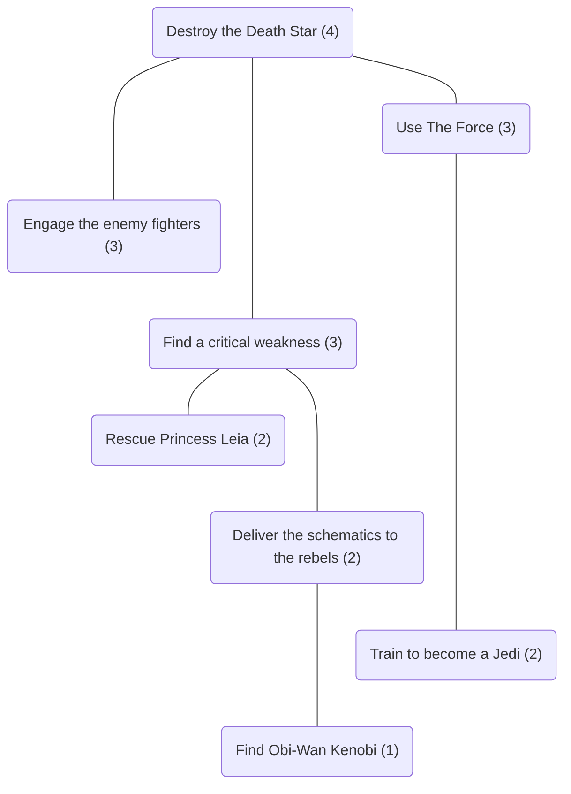

# Prophecy
Prophecy is a tabletop roleplaying game about a group of heroes who dare to defy fate. It is a game for three to six people that is designed to be playable in less than three hours.

During the game, the Players [Receive a Prophecy](#receive-a-prophecy) that describes an impending Catastrophe for some Fictional World.
They [Create Characters](#create-characters) who inhabit that Fictional World, [Write an Outline](#write-an-outline) that describes how the Characters will try to prevent the Catastrophe, and [Tell the Story](#tell-the-story) of the Characters' adventures as they try to enact their plan.

---

## Objects and Aspects
An _Object_ is a person, place, or thing that appears in the [Story](#tell-the-story).
An _Aspect_ is a word or short phrase that describes something noteworthy about a [Character](#create-characters) or Object.
Each Aspect is _Attached_ to a single Character or Object.

### Matching Aspects
A pair of _Matching Aspects_ is a set of two Aspects, one Attached to a Character and one Attached to an Object, that together allow the Characters to manipulate a [Scene](#scenes) to their advantage.
Pairs of Matching Aspects are used to determine the size of the Dice Pool when making a [Check](#checks).

<!-- #### Example
Recall that in the previous example, the Characters were trying to convince a guard to let them through a checkpoint and that the Aspect "Sterling Reputation" is Attached to the guard who is on duty when the Characters arrive.
The Aspect "Silver Tongue" is Attached to one of the Characters.
If the Players agree that this combination of Aspects might allow the characters to manipulate the Scene to their advantage, perhaps by suggesting that he guard might be amenable to accepting a bribe offered by the Character, then together they would constitute a pair of Matching Aspects. -->

---

## Scenes
A _Scene_ is a part of the [Story](#tell-the-story) that describes the events that happen at single time and place.
Every Scene has the following components:
  - __Objective__ - A narrative description of what the [Characters](#create-characters) are trying to accomplish during the Scene.
  - __Setting__ - The time and place at which the Scene occurs. The Setting includes the [Objects and Aspects](#objects-and-aspects) that appear in the Scene.
  - __Difficulty Rating__ - A number _1 <= d <= 4_ that describes how difficult it is for the Players to succeed at the [Check](#checks) to determine the Outcome of the Scene.

<!-- #### Example
The Characters want to cross the border between two neighbouring kingdoms. It is dusk when they make their way to a "Remote" border crossing on the outskirts of a small town. The border is patrolled by a detachment of soldiers from the "Local Militia". The soldier on duty when the Characters arrive is well-known in town to have a "Sterling Reputation". The guards are on "High Alert" and it will be fairly difficult for the Characters to convince the guard on duty to let them through the checkpoint. The Difficulty Rating of the scene is _d = 3_. -->

### Sketching Scenes
The Players _Sketch_ Scenes when they [Write an Outline](#write-an-outline) describing the how the Characters will try to prevent the Catastrophe. To Sketch a Scene, the Players will define the Objective, establish the Setting, and assign the Difficulty Rating for the Scene.

### Performing Scenes
The Players _Perform_ Scenes when they [Tell a Story](#tell-the-story) about the Characters' adventures as they try to enact the plan described in the Outline. To Perform a Scene, the Players will:
   1. __Investigate the Scene__ - The Players describe [Objects and Aspects](#objects-and-aspects) that the Characters might encounter in the Scene.
   2. __Make a Check__ - The Players identify pairs of [Matching Aspects](#matching-aspects) and make a [Check](#checks) to determine the Outcome of the Scene.
   3. __Interpret the Outcome__ - The Players describe the Characters' actions in the Scene, how they led to the specified Outcome, and the narrative consequences of that Outcome.  

### Precursors
One Scene is a _Precursor_ to another Scene if accomplishing the Objective in the first Scene makes it easier to accomplish the Objective in the second Scene. When Players [Write an Outline](#write-an-outline), each new Scene that they Sketch must be a Precursor to another Scene. When Players [Tell the Story](#tell-the-story), they must Perform all of a given Scene's Precursors before Performing that Scene.

---

## Checks
The players make a _Check_ to determine the _Outcome_ of each [Scene](#scenes).
To make a Check, the Players will:
   1. __Assemble a Dice Pool__ -
      A _Dice Pool_ is made up of one or more six-sided dice (d6s).
      One die is added to the Dice Pool for each pair of [Matching Aspects](#matching-aspects) that characters could use to manipulate the scene to their advantage.
      In addition, one die is added to the Dice Pool for each of the current Scene's [Precursors](#Precursors) that was resolved successfully.
   2. __Roll the Dice__ -
      The dice in the Dice Pool are _Exploding Dice_.
      That is, for every die that yields a value of `6` one additional die is added to the Dice Pool.
   3. __Compute the Result__ -
      Any die that yields a value of `1`, `2`, or `3` is a _Miss_.
      Any die that yields a value of `4`, `5`, or `6` is a _Hit_.
      The _Result_ of a roll is the total number of Hits.
   4. __Determine the Outcome__ -
      If the Result of the Players' roll meets or exceeds the Scene's Difficulty Rating, then the Outcome is a _Success_, the characters accomplish their objective, and the Scene was resolved successfully.
      Otherwise, the Outcome is a _Failure_, the Characters do not accomplish their objective, and the Scene was resolved unsuccessfully.

<!-- #### Example
The Players are making a Check to determine the Outcome of a Scene that has a Difficulty Rating of _d = 3_.
The Players have identified three pairs of [Matching Aspects](#objects-and-aspects) while Performing the Scene and earned two Reward Dice in the Scenes immediately upstream of the current Scene.
Therefore, the Dice Pool consists of five dice.
When rolled, these dice yield the values {`3`, `6`, `5`, `1`, `6`}.
Because two of the dice yielded a value of `6`, two additional dice are added to the pool.
When rolled, these dice yield the values {`2`,`6`}.
Because one of the dice yielded a value of `6`, one additional die is added to the pool.
When rolled, this die yields the value {`4`}.
So, this roll yields the values {`3`, `6`, `5`, `1`, `6`, `2`, `6`, `4`}.
The Result of this roll is five Hits.
This Result exceeds the Difficulty Rating of the Scene so the Outcome of the Check is a Success.    -->

---
## Receive a Prophecy
During this phase of the game, the _Players_ receive a _Prophecy_ that describes a _Catastrophe_ that is destined to wreak havoc on some _Fictional World_.

To Receive a Prophecy the Players describe the the Fictional World in which the Story is set and the nature of the impending Catastrophe. The Players should create a situation that the Characters will be able to affect, but doing so will be both difficult and dangerous.

<!-- To Receive the Prophecy, the Players will roll a six-sided die (1d6) to select a random Genre from the [Genre Table](#genre-table) and then roll a six-sided die (1d6) to select a random Catastrophe from the [Catastrophe Table](#catastrophe-table).

### Genre Table
  1. Fantasy
  2. Science Fiction
  3. Horror
  4. Romance
  5. Adventure
  6. Mystery

### Catastrophe Table
  1. War
  2. Revolution
  3. Disease
  4. Natural Disaster
  5. Resource Depletion
  6. Climate Change -->

---

## Create Characters
During this phase of the game, the Players create _Characters_.
Later in the game, the Players will assume the identities of these Characters when they [Perform Scenes](#performing-scenes).

To Create Characters, each Player will first choose a name for their Character and then Attach one [Aspect](#objects-and-aspects) from each of the following categories to their Character:
   - __Occupation__ - An Aspect that describes a Character's profession, hobbies, or other interests.
   - __Physical or Mental Characteristic__ - An Aspect that describes a Character's body or mind.
   - __Psychological Characteristic__ - An Aspect that describes a Character's personality.
   - __Relationship__ - An Aspect that describes a Character's connection with another Character.
   - __Affiliation__ - An Aspect that describes a Character's connection with an organisation.

During the game additional Aspects can be Attached to a Character and existing Aspects can be modified to reflect how a Character changes in response to the events that occur as the Players [Tell the Story](#tell-the-story).

---

## Write an Outline
During this phase of the game, the Players will write an _Outline_ that describes how their Characters will try to prevent the Catastrophe. The Outline describes a collection of [Scenes](#scenes) that are arranged in a hierarchical tree-like structure.

To Write the Outline, the Players will first [Sketch a Scene](#sketching-scenes) called the _Finale_. The Finale will be the last Scene that the Players Perform when they [Tell the Story](#tell-the-story). The Objective of the Finale should describe how the Characters intend to prevent the prophesied catastrophe. The Difficulty Rating of the Finale is always _d = 4_.

Then, the Players will Sketch additional Scenes that describe the events that will lead to the Finale.
Each new Scene must be a Precursor of an existing Scene.
That is, accomplishing the Objective of the new Scene must make it easier for the Characters to accomplish their Objective in the existing Scene.
The Difficulty Rating of the new Scene is always one less than that of the existing Scene and must be greater than zero.

<!-- #### Example

--- -->

---

## Tell the Story
During this phase of the game, the Players will tell a _Story_ about their Characters' adventures as they try to enact their plan to prevent the Catastrophe.

To Tell the Story, the players will [Perform the Scenes](#performing-scenes) described in the [Outline](#write-an-outline). Recall that during a [Check](#checks) to determine the Outcome of a Scene, one die is added to the Dice Pool for each of that Scene's [Precursors](#precursors) that was resolved successfully.
So, a Scene cannot be Performed until after all of its Precursors have been Performed. Other than this restriction, however, the Scenes can be Performed in any order.

---

## Time Limits
The Story should be tightly focused on the Finale.
To encourage this kind of storytelling, the Players should adhere to the following guiding principles:
   - __Short Scenes:__ - Each Scene should be Performed in no more than eight minutes of real time.
   - __Simple Structures__ - The [Outline](#outline) should consist of no more than eight [Scenes](#scenes).

---

## Acknowledgements
Thanks to everyone who helped refine the design of Prophecy:
  - Keydan Bruce
  - Farzana Choudhury
  - Michael Cromer
  - Dannielle Harden
  - Sarah Hewat
  - Scott Joblin
  - Kira Purcell
  - Luke Purcell
  - Jo Stephenson
  - Brett Witty

---
